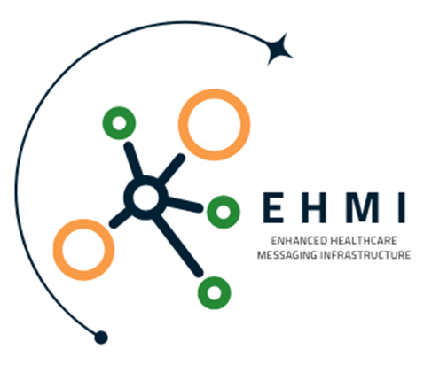

EHMI SMP (Service Metadata Provider) – konfiguration

Version af 01-04-2024 15:27

Indhold

[2 Version history](#version-history)

[3 Referencer](#referencer)

[4 SBDH BusinessScopes](#_Toc161170580)

[4.1 BusinessScope for generel eDelivery meddelelseskommunikation](#businessscope-for-generel-edelivery-meddelelseskommunikation)

[4.1.1 Sammenhæng til SMP](#sammenhæng-til-smp)

[*4.1.2* DOCUMENTID](#smpdocumentid)

[*4.1.2.1* DOCUMENTID for MedCom FHIR Meddelelser](#documentid-for-medcom-fhir-meddelelser)

[*4.1.2.2* DOCUMENTID for MedCom kvitteringer](#documentid-for-medcom-kvitteringer)

[4.1.2.3 DOCUMENTID Kvitterings Eksempler](#documentid-kvitterings-eksempler)

[4.1.3 PROCESSID](#smpprocessid)

[4.1.3.1 PROCESSID Eksempel: Brug i 4-corner model](#processid-eksempel-brug-i-4-corner-model)

# Version history

| **Dokument/Kapitel**                                          | **Rettelse** | **Dok version** | **Forfatter**         |
|---------------------------------------------------------------|--------------|-----------------|-----------------------|
| Standard Business Document Header (SBDH) – EHMI konfiguration | 1. version   | 0.90            | Ole Vilstrup, MedCom  |
|                                                               |              |                 |                       |

# Referencer

| **Reference**             | **Navn**                                                                                   | **Filnavn**                                                   | **Placering**                                                                                                                                                                                                                                                   |
|---------------------------|--------------------------------------------------------------------------------------------|---------------------------------------------------------------|-----------------------------------------------------------------------------------------------------------------------------------------------------------------------------------------------------------------------------------------------------------------|
| [Policy_identifiers]      | PEPPOL Transport Infrastructure  ICT - Models  Policy for use of Identifiers, Version: 4.0 | PEPPOL-EDN-Policy-for-use-of-identifiers-4.0-2019-01-28.pdf   | <https://docs.peppol.eu/edelivery/policies/PEPPOL-EDN-Policy-for-use-of-identifiers-4.0-2019-01-28.pdf>                                                                                                                                                         |
| [DKEDEL_PIV_CodeList]     | DK_EDEL Code Lists - Participant identifier schemes v7.2                                   | DK_EDEL Code Lists - Participant identifier schemes v7.2.xlsx | <https://medcomtest.sharepoint.com/:x:/s/MedComModerniseringsPilot2020/EQSLr01jvoROrbkqCd6yhvQBLUyxUPPAP_MX2WTBjMGRaQ?e=THfhXm>                                                                                                                                 |
| [DKEDEL_TP_CodeList]      | Dansk eDelivery Code Lists - Transport profiles v7.2                                       | Dansk eDelivery Code Lists - Transport profiles v7.2.xlsx     | <https://medcomtest.sharepoint.com/:x:/s/MedComModerniseringsPilot2020/EdlEjIlLDadJuy7RjD926bkB0X5X-0m1JuQG_VF8Je2f-g?e=4b7jF8>                                                                                                                                 |
| [DKEDEL_DT_CodeList]      | Dansk eDelivery Code Lists - Document types v7.2. (MedCom meddelelser)                     | Dansk eDelivery Code Lists - Document types v7.2.xlsx         | <https://medcomtest.sharepoint.com/:x:/r/sites/MedComModerniseringsPilot2020/Delte%20dokumenter/eDelivery/Dansk%20eDelivery/DK_EDEL%20Code%20Lists%20-%20Document%20types%20v7.2%20-%2020211122.xlsx?d=wf68cc9cce4594eae8b8c8d26c828280c&csf=1&web=1&e=H5LYNJ>  |
| [PEPPOL_SBDH12]           | PEPPOL Business Message Envelope (SBDH) 1.2                                                | PEPPOL-EDN-Business-Message-Envelope-1.2-2019-02-01.pdf       | <https://medcomtest.sharepoint.com/:b:/s/MedComModerniseringsPilot2020/EeWbN0HnqcZMhel_56f8tCcB7G-boIwnP5PeoMAsDU5lCQ?e=gXR3cY>                                                                                                                                 |
| [DDS Metadata]            | DDS Metadata-v096                                                                          | DDS Metadata-v096.docx                                        | <http://svn.medcom.dk/svn/drafts/Standarder/IHE/DK_profil_metadata/Metadata-v096.docx>                                                                                                                                                                          |
| [DDS_Metadata- ValueSets] | DK-IHE_Metadata-Common_Code_systems-Value_sets                                             | DK-IHE_Metadata-Common_Code_systems-Value_sets.xlsx           | <http://svn.medcom.dk/svn/drafts/Standarder/IHE/OID/DK-IHE_Metadata-Common_Code_systems-Value_sets.xlsx>                                                                                                                                                        |
| [ebxmlbp]                 | ebxmlbp-v2.0.4-Spec-os-en                                                                  | ebxmlbp-v2.0.4-Spec-os-en.pdf                                 | <https://docs.oasis-open.org/ebxml-bp/2.0.4/OS/spec/ebxmlbp-v2.0.4-Spec-os-en.pdf>                                                                                                                                                                              |
| [SBDHschema]              | Standard Business Document Header Schema for pilot                                         | MedComStandardBusinessDocumentHeader_20210217.xsd             | <https://medcomtest.sharepoint.com/:u:/s/MedComModerniseringsPilot2020/EdudZoIaoXtAgC_PhWGKvCwBscQxkP54bYLqWQPx86SxuQ?e=bITgGk>                                                                                                                                 |
| EER                       | EHMI Endpoint Register                                                                     |                                                               |                                                                                                                                                                                                                                                                 |
| EDS                       | EHMI Delivery Status                                                                       |                                                               |                                                                                                                                                                                                                                                                 |

# eDelivery SMP profile

The eDelivery SMP profile is an open specification for publishing service metadata within a 4-corner network. To successfully send a business document in a 4-corner network, an entity must be able to discover critical metadata about the recipient (Access Point) of the business document, such as types of documents the Access Point is capable of receiving and methods of transport supported. The recipient makes this metadata available to other entities in the network through a Service Metadata Publisher service. The eDelivery SMP profile describes the request/response exchanges between a Service Metadata Publisher and a client wishing to discover Access Point metadata. The profile is based on the OASIS Service Metadata Publishing (SMP) Version 1.0 standard.

# SBDH BusinessScopes

## BusinessScope for generel eDelivery meddelelseskommunikation

### Sammenhæng til SMP

i eDelivery kommunikationen udgør SBDH’ens Scope struktur med de to typer, DOCUMENTID og PROCESSID, foruden de allerede gennemgåede elementer i Sender og Receiver, den direkte sammenhæng til SMP’ens DOCUMENTID og PROCESSID. I det følgende beskrives netop disse 2 Type elementer i SBDH’ens overordnede BusinessScope struktur.

Scopene DOCUMENTID og PROCESSID er i PEPPOL fast definerede scopes, som sikrer en unik relation til SMP. DOCUMENTID og PROCESSID anvendes i EHMI med samme præcision som i PEPPOL, så der sikres en vis ensartethed i, hvordan man udtrykker værdierne på tværs af PEPPOL og EHMI. DOCUMENTID og PROCESSID bruges af AP’erne sammen med modtagers ReceiverId til at slå modtagers eDelivery adresse op i SMP med et unikt respons som resultat.

### SMP:DOCUMENTID

Værdien i InstanceIdentifier er identisk med den tilsvarende SMP-registrering

Værdierne hentes fra MedComs standardkatalog og er her repræsenteret ved de værdier, som de har i MedCom meddelelserne. Se bogmærke: [DKEDEL_DT_CodeList]

Ift. det oprindeligt intentionerede fjernes dobbelt ”\#\#” og ”::” fra konstruktionen af InstanceIdentifier, da den aktuelle konfiguration af SMP fra CEF ikke kan håndtere disse så værdierne kan fremsøges igen. Dermed må SBDH’s DOCUMENTID ændres tilsvarende.

#### DOCUMENTID for MedCom FHIR Meddelelser

\<Scope\>

\<Type\>DOCUMENTID\</Type\>

\<InstanceIdentifier\>

urn:dk:healthcare:prod:medcom:messaging:fhir:structuredefinition:[Bundle.MessageHeader.eventCoding.code.value]\#urn:dk:medcom:fhir:[Bundle.MessageHeader.definition.[value of \|]]

\</InstanceIdentifier\>

\<Identifier\>dk-medcom-messaging\</Identifier\>

\</Scope\>

##### DOCUMENTID for MedCom FHIR Meddelelseseksempel

\<Scope\>

\<Type\>DOCUMENTID\</Type\>

\<InstanceIdentifier\>

urn:dk:medcom:prod:messaging:fhir:structuredefinition:homecareobservation-message\#urn:dk:medcom:fhir:homecareobservation:3.0

\</InstanceIdentifier\>

\<Identifier\>dk-medcom-messaging\</Identifier\>

\</Scope\>

#### DOCUMENTID for MedCom kvitteringer

##### DOCUMENTID for MedCom FHIR Kvitteringer:

\<Scope\>

\<Type\>DOCUMENTID\</Type\>

\<InstanceIdentifier\>

urn:dk:healthcare:prod:messaging:medcom:messaging:fhir:structuredefinition:[Bundle/MessageHeader/eventCoding/code.value]\#urn:dk:medcom:fhir:[https://medcomfhir.dk/ig/homecareobservation/2.1.0]

\</InstanceIdentifier\>

\<Identifier\>urn:urn:dk:healthcare:prod:messaging:medcom:messaging \</Identifier\>

\</Scope\>

##### DOCUMENTID for SBDH Kvitteringer:

\<Scope\>

\<Type\>DOCUMENTID\</Type\>

\<InstanceIdentifier\>

urn:dk:healthcare:prod:oasis:messaging:ebxml:schema:xsd:[eMessage/[LetterType]]\#urn:dk:healthcare:prod:messaging:medcom:messaging:oioxml:schema:xsd:[eMessage/[LetterType]]/[Letter/**StatisticalCode**]:[eMessage/[LetterType]]/[Letter/VersionCode]

\</InstanceIdentifier\>

\<Identifier\>urn:dk:healthcare:prod:messaging:medcom:messaging\</Identifier\>

\</Scope\>

#### DOCUMENTID Kvitterings Eksempler

##### DOCUMENTID for MedCom FHIR Kvitteringseksempel:

\<Scope\>

\<Type\>DOCUMENTID\</Type\>

\<InstanceIdentifier\>

urn:dk:healthcare:prod:messaging:medcom:messaging:oioxml:schema:xsd:PositiveReceipt\#urn:dk:healthcare:prod:messaging:medcom:messaging:oioxml:schema:xsd:PositiveReceipt:XCTL03:XC0330Q

\</InstanceIdentifier\>

\<Identifier\>urn:dk:healthcare:prod:messaging:medcom:messaging:oioxml\</Identifier\>

\</Scope\>

##### DOCUMENTID SBDH Kvitteringseksempel:

\<Scope\>

\<Type\>DOCUMENTID\</Type\>

\<InstanceIdentifier\>

urn:urn:dk:healthcare:prod:messaging:medcom:messaging:ebxml:schema:xsd:SBDHReceiptAcknowledgement

\</InstanceIdentifier\>

\<Identifier\>urn:urn:dk:healthcare:prod:messaging:medcom:messaging:ebxml\</Identifier\>

\</Scope\>

### SMP:PROCESSID

Værdien i InstanceIdentifier er identisk med den tilsvarende ProcessId SMP-registrering.

Værdien hentes fra nedenstående tabel:

**dk-messaging Process Identifier values**

| **Process**   | **Process Identifier value (InstanceIdentifier)** | **Identifier type** |
|---------------|---------------------------------------------------|---------------------|
| sdn-emergence | sdn-emergence                                     | dk-messaging-procid |

#### PROCESSID Eksempel: Brug i 4-corner model

I 4-corner modellen sendes emergence-registreringen med til SMP, således at afsenders AP kan slå finalreceipient op korrekt i SMP.

PROCESSID for SDN Eksempel

\<Scope\>

\<Type\>PROCESSID\</Type\>

\<InstanceIdentifier\>sdn-emergence\</InstanceIdentifier\>

\<Identifier\>dk-messaging-procid\</Identifier\>

\</Scope\>
