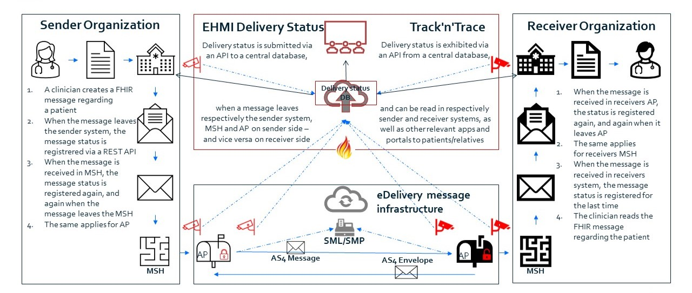

# EHMI Delivery Status (EDS)

***

    **Disclaimer** 
    
    **The menu items above marked with a star are yet not specified**
    
    ***Shifts of languages between English and Danish will occur in this version - that will change completely to English in the next upcoming version***
    
  

## EHMI Delivery Status is defined as 
- The EDS Server component implemented as a FHIR server that will host the registered data coming in from the clients at each station of EUAs, MSHs and APs in the primary and secondary messaging flow. The server will expose two FHIR APIs for the client to registrate their status:
    - <a href="https://build.fhir.org/ig/medcomdk/dk-ehmi-eds/StructureDefinition-EdsBasicDeliveryStatus.html" target="_blank">EdsBasicDeliveryStatus</a> for registrations of message status without patient data, eg. Acknowledgments (opens in a new window)
    - <a href="https://build.fhir.org/ig/medcomdk/dk-ehmi-eds/StructureDefinition-EdsPatientDeliveryStatus.html" target="_blank">EdsPatientDeliveryStatus</a> for registrations of message status containing patient data (opens in a new window)
- The EDS clients that handle the registration of EHMI Delivery Status (FHIR AuditEvents) from each "station" in both the primary and secondary message delivering from a sender system to a receiver system. That is, EDS Clients can be either an EUA, a MSH or an AP.
    
  
  
The EDS Server and EDS Clients are expected to implement the user stories outlined [here:](./userstories/index.md)

  
  
**The whole specification for EHMI Delivery Status can be found** 
<a href="https://build.fhir.org/ig/medcomdk/dk-ehmi-eds/" target="_blank">here</a>
    
  
  
## An outline of the components of the EHMI Delivery Status can be seen here:
    
  

